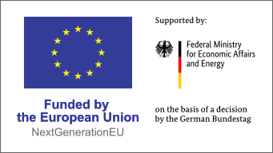

<p align="center">
  
</p>

<h1 align="center">Chat UI Operator</h1>

<p align="center">
  <strong>Open WebUI as a Service for OpenAI-compatible LLM backends</strong>
</p>

<p align="center">
  <a href="https://github.com/apeirora/showroom-msp-chat-ui/releases"></a>
  <a href="go.mod"></a>
  <a href="https://github.com/apeirora/showroom-msp-chat-ui/actions/workflows/ci.yml"></a>
  <a href="LICENSE"></a>
  <a href="https://api.reuse.software/info/github.com/apeirora/showroom-msp-chat-ui"></a>
</p>

<p align="center">
  Part of the <a href="https://apeirora.eu/">ApeiroRA</a> Platform Mesh ecosystem
</p>

---

## What is Chat UI Operator?

Chat UI Operator is a Kubernetes operator that deploys per-tenant [Open WebUI](https://github.com/open-webui/open-webui) instances connected to OpenAI-compatible backends -- primarily the [Private LLM](https://github.com/apeirora/showroom-msp-private-llm) operator. Users create a `ChatUIInstance` custom resource, and the operator provisions a fully wired Deployment, Service, and Ingress with a unique public URL.

It is designed for the **ApeiroRA Showroom** -- a demo and experimentation environment -- and integrates natively with [Platform Mesh](https://apeirora.eu/) via KCP workspaces, sync agents, and the Showroom portal UI.

## Key Features

- **One CR = One Chat UI** -- Each `ChatUIInstance` gets its own Open WebUI deployment with a stable, unique URL
- **Credential wiring** -- Reads `OPENAI_API_URL` and `OPENAI_API_KEY` from a referenced Secret; auto-rolls pods on Secret changes
- **Readiness gating** -- Reports `status.phase=Ready` only after Deployment, Service endpoints, HTTP health checks, and DNS resolution all pass
- **Platform Mesh native** -- Ships with Helm charts for sync agent, APIExport, ProviderMetadata, and a portal content bundle
- **OpenTelemetry built-in** -- Traces every reconciliation via OTLP or stdout
- **Demo-first defaults** -- Auth disabled, minimal UI features enabled, safe for showroom use

## Architecture at a Glance

```
                   KCP Control Plane
            ┌─────────────────────────────┐
            │  Provider Workspace         │
            │  ┌───────────────────────┐  │
            │  │ APIExport             │  │       Showroom Portal
            │  │ ui.privatellms.msp    │◄─┼──── (reads ProviderMetadata
            │  │                       │  │      + ContentConfiguration)
            │  │ ProviderMetadata      │  │
            │  │ ContentConfiguration  │  │
            │  └───────────────────────┘  │
            │                             │
            │  Org Workspace              │
            │  ┌───────────────────────┐  │
            │  │ ChatUIInstance (user)  │  │
            │  │ Secret (credentials)  │  │
            │  └──────────┬────────────┘  │
            └─────────────┼───────────────┘
                          │ sync
              ┌───────────▼───────────┐
              │   KCP Sync Agent      │
              │  (PublishedResource)  │
              └───────────┬───────────┘
                          │
              ┌───────────▼───────────┐
              │   MSP Cluster         │
              │                       │
              │  ChatUIInstance CR ──► │ Chat UI Operator
              │                       │    │
              │       ┌───────────────┼────▼──────────┐
              │       │ Deployment    │ Service        │
              │       │ (Open WebUI)  │ Ingress        │
              │       └───────────────┼────────────────┘
              └───────────────────────┘
                          │
                   <slug>.<PUBLIC_HOST>
```

## Quick Start

### Install the Operator

```bash
helm upgrade --install chat-ui-operator \
  oci://ghcr.io/apeirora/charts/chat-ui-operator \
  --namespace chat-ui --create-namespace \
  --set env.PUBLIC_HOST="chat.example.com" \
  --set env.PUBLIC_SCHEME=https
```

### Create a Credentials Secret

```yaml
apiVersion: v1
kind: Secret
metadata:
  name: my-llm-creds
  labels:
    apeirora.eu/llm-api-compatibility: "openai"
type: Opaque
stringData:
  OPENAI_API_URL: "https://my-llm-endpoint/v1"
  OPENAI_API_KEY: "sk-..."
```

### Create a ChatUIInstance

```yaml
apiVersion: ui.privatellms.msp/v1alpha1
kind: ChatUIInstance
metadata:
  name: my-chat
spec:
  credentialsSecretRef:
    name: my-llm-creds
  replicas: 1
```

### Check the Status

```bash
kubectl get chatuiinstances -o wide
# NAME      SECRET        PHASE   URL
# my-chat   my-llm-creds  Ready   https://abc123.chat.example.com
```

## Documentation

| Guide | Description |
|----------|-------------|
| [Architecture](docs/architecture.md) | Component interactions, CRD lifecycle, data flow diagrams |
| [Helm Installation](docs/installation-helm.md) | Install via Helm on any cluster |
| [OCM Installation](docs/installation-ocm.md) | Install via Open Component Model |
| [Local Development](docs/installation-local.md) | Run locally with Kind |
| [Remote Deployment](docs/installation-remote.md) | Deploy to a remote cluster |
| [User Guide](docs/user-guide.md) | Platform Mesh integration, portal usage, troubleshooting |

## Helm Charts

This repository ships four Helm charts:

| Chart | Purpose | Registry |
|-------|---------|----------|
| `chat-ui-operator` | Controller manager + CRD | `oci://ghcr.io/apeirora/charts/chat-ui-operator` |
| `chat-ui-sync-agent` | KCP sync agent + PublishedResources | `oci://ghcr.io/apeirora/charts/chat-ui-sync-agent` |
| `chat-ui-pm-integration` | APIExport, ProviderMetadata, ContentConfiguration | `oci://ghcr.io/apeirora/charts/chat-ui-pm-integration` |
| `chat-ui-ui` | Portal content server (nginx serving `pm-content.json`) | `oci://ghcr.io/apeirora/charts/chat-ui-ui` |

## Container Images

| Image | Description |
|-------|-------------|
| `ghcr.io/apeirora/chat-ui-controller` | Operator controller binary (distroless) |

## Project Structure

```
.
├── api/v1alpha1/             # CRD type definitions (ChatUIInstance)
├── cmd/main.go               # Operator entrypoint
├── internal/controller/      # Reconciler logic
├── charts/
│   ├── chat-ui-operator/     # Operator Helm chart
│   ├── chat-ui-sync-agent/   # Sync agent chart
│   ├── chat-ui-pm-integration/  # KCP portal metadata
│   └── chat-ui-ui/           # Portal content server
├── config/
│   ├── crd/                  # Generated CRD manifests
│   └── samples/              # Example CR + Secret
├── .ocm/                     # OCM component descriptor
└── .github/workflows/        # CI + Release pipelines
```

## Contributing

1. Fork the repository
2. Create a feature branch (`git checkout -b feat/my-feature`)
3. Run tests: `make test`
4. Run linters: `make lint`
5. Submit a pull request

## License

Apache License 2.0 -- see [LICENSE](LICENSE) for details.

---

<p align="center">
  <sub>Built with care by <a href="https://apeirora.eu/">ApeiroRA</a></sub>
</p>

<p align="center">
  <a href="https://apeirora.eu/">
    
  </a>
</p>
