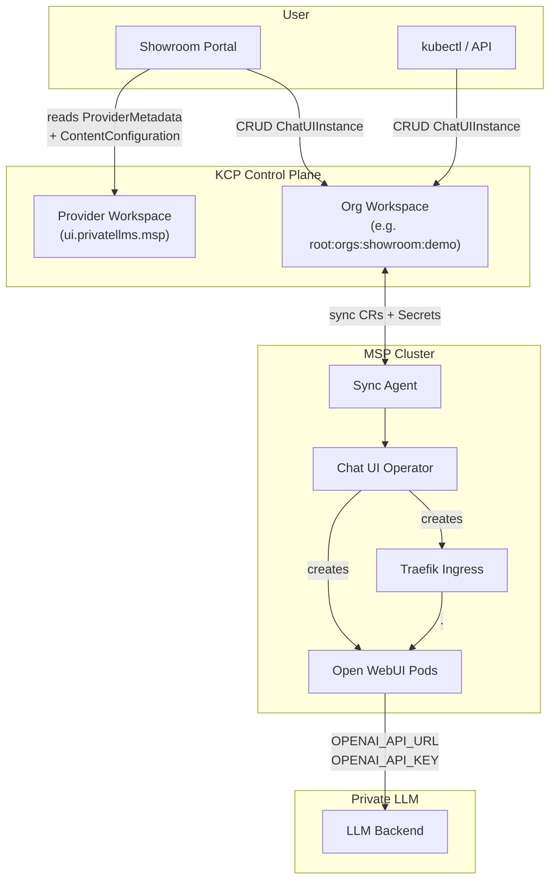
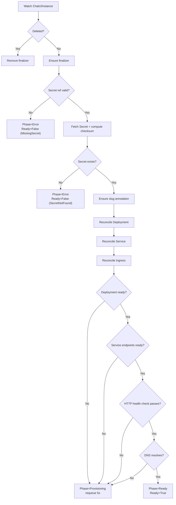
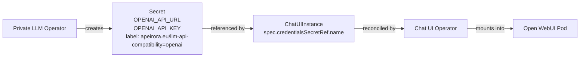

# Architecture

This document describes the architecture of the Chat UI Operator, its relationship to other Platform Mesh components, and the lifecycle of a `ChatUIInstance` resource.

---

## Component Overview

The Chat UI system consists of four deployable components, each packaged as a separate Helm chart:

| Component | Runs On | Purpose |
|-----------|---------|---------|
| **chat-ui-operator** | MSP cluster | Watches `ChatUIInstance` CRs, creates Deployments/Services/Ingresses |
| **chat-ui-sync-agent** | MSP cluster | Bridges KCP workspace CRs to MSP cluster via `PublishedResource` |
| **chat-ui-pm-integration** | KCP control plane | Registers `APIExport`, `ProviderMetadata`, `ContentConfiguration` |
| **chat-ui-ui** | MSP cluster | Nginx serving `pm-content.json` for the Showroom portal UI |

## System Context



## CRD: ChatUIInstance

### API Group and Version

```
apiVersion: ui.privatellms.msp/v1alpha1
kind: ChatUIInstance
```

### Spec Fields

| Field | Type | Required | Default | Description |
|-------|------|----------|---------|-------------|
| `spec.credentialsSecretRef.name` | `string` | Yes | -- | Secret in the same namespace with `OPENAI_API_URL` and `OPENAI_API_KEY` |
| `spec.replicas` | `int32` | No | `1` | Number of Open WebUI pods. Set to `0` to pause. |
| `spec.image` | `string` | No | `ghcr.io/open-webui/open-webui:latest` | Override the Open WebUI container image |

### Status Fields

| Field | Type | Description |
|-------|------|-------------|
| `status.phase` | `string` | `Provisioning`, `Ready`, or `Error` |
| `status.url` | `string` | Public URL (`<scheme>://<slug>.<PUBLIC_HOST>`) |
| `status.observedGeneration` | `int64` | Last generation processed by the controller |
| `status.conditions` | `[]Condition` | Standard Kubernetes conditions (type: `Ready`) |

### Print Columns

```
NAME     SECRET           PHASE   URL
my-chat  my-llm-creds     Ready   https://abc123.chat.example.com
```

## Reconciliation Flow



### Key Behaviors

**Slug generation.** Each instance gets a random 12-character slug stored as the annotation `ui.privatellms.msp/slug`. This slug is stable across reconciliations and forms the subdomain: `<slug>.<PUBLIC_HOST>`.

**Secret checksum.** The controller computes a SHA256 checksum of the referenced Secret's data and stores it as a pod template annotation. When the Secret changes, the checksum changes, triggering a rolling update.

**Secret watch.** The controller watches all Secrets and maps changes back to `ChatUIInstance` CRs that reference them via `spec.credentialsSecretRef.name`.

**Readiness gating.** The instance only reaches `Ready` after four checks pass in sequence:
1. Deployment has all replicas available
2. Service has ready endpoints on port 8080
3. In-cluster HTTP probe to the Service returns 2xx/3xx
4. DNS resolution of the instance hostname succeeds

## Relationship to Private LLM

The Chat UI Operator does not directly depend on the Private LLM operator at the code level. The connection is through a **Secret contract**:



The Secret must contain:
- `OPENAI_API_URL` -- OpenAI-compatible base URL (typically ending with `/v1`)
- `OPENAI_API_KEY` -- Authentication token

The label `apeirora.eu/llm-api-compatibility=openai` enables discovery in the Showroom portal's create form.

## Platform Mesh Integration

### KCP Resources

The `chat-ui-pm-integration` chart installs three resources into the KCP provider workspace:

| Resource | Kind | Purpose |
|----------|------|---------|
| `ui.privatellms.msp` | `APIExport` | Exports `ChatUIInstance` CRD, claims namespaces/events/secrets |
| `ui.privatellms.msp` | `ProviderMetadata` | Display name, description, icon for marketplace |
| `chat-ui` | `ContentConfiguration` | Points to the `pm-content.json` URL served by `chat-ui-ui` |

### Sync Agent

The sync agent bridges KCP org workspaces to the MSP cluster:

1. User creates `ChatUIInstance` in a KCP org workspace
2. Sync agent detects it via `PublishedResource` configuration
3. Sync agent creates a mirrored `ChatUIInstance` in the MSP cluster under namespace `{{ .ClusterName }}`
4. The `related` section also syncs the referenced credentials Secret from KCP to the MSP cluster
5. Chat UI Operator reconciles the local CR
6. Status updates flow back to KCP via the sync agent

### Portal Content

The `chat-ui-ui` chart deploys an nginx server that serves `pm-content.json`. This JSON fragment tells the Showroom portal how to render:
- A **list view** showing Name, Replicas, Status, and a clickable URL
- A **create form** with fields for Name, Replicas, and a Credentials Secret dropdown (populated via GraphQL query filtering by the `apeirora.eu/llm-api-compatibility=openai` label)

## Managed Resources per Instance

For each `ChatUIInstance`, the operator creates and owns:

| Resource | Name Pattern | Notes |
|----------|-------------|-------|
| `Deployment` | `<instance>-chatui` | Open WebUI container, owner-referenced |
| `Service` | `<instance>-chatui` | ClusterIP on port 8080 |
| `Ingress` | `<instance>-chatui` | Traefik ingress class, host = `<slug>.<PUBLIC_HOST>` |

All three are garbage-collected when the `ChatUIInstance` is deleted.

## Observability

The operator initializes an OpenTelemetry `TracerProvider` on startup:

- If `OTEL_EXPORTER_OTLP_ENDPOINT` is set, traces are exported via OTLP/HTTP
- Otherwise, traces are printed to stdout (pretty-printed)

Every reconciliation is wrapped in a span with `trace_id` and `span_id` injected into the structured logger.
