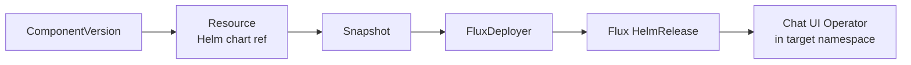

# OCM Installation

Deploy the Chat UI Operator using the [Open Component Model](https://ocm.software/) (OCM) supply chain. The OCM controller resolves the component version from an OCI registry, extracts the Helm chart via a `Resource`, and hands it to a `FluxDeployer` that creates a Flux `HelmRelease`.

---

## Prerequisites

- Kubernetes cluster with:
  - [OCM Controller](https://github.com/open-component-model/open-component-model) installed
  - [Flux](https://fluxcd.io/) controllers (source-controller, helm-controller)
- `kubectl`, `helm` 3.12+
- `GITHUB_TOKEN` with read access to GHCR packages

> **Note**: KRO is **not** required. The chart uses the OCM controller's built-in `FluxDeployer` to create the `HelmRelease` directly.

## Architecture



The Helm chart creates three OCM custom resources:

| Resource | Kind | Purpose |
|----------|------|---------|
| `chat-ui` | `ComponentVersion` | Points to the OCM component in the OCI registry |
| `chat-ui-chart` | `Resource` | Extracts the Helm chart artifact from the component |
| `chat-ui` | `FluxDeployer` | Creates a Flux `HelmRelease` from the extracted chart |

All three resources are created in the `ocm-system` namespace.

## Step 1: Create GHCR Credentials

The OCM controller needs pull access to `ghcr.io/apeirora`:

```sh
kubectl -n ocm-system create secret docker-registry ghcr-credentials \
  --docker-server=ghcr.io \
  --docker-username="apeirora" \
  --docker-password="$GITHUB_TOKEN" \
  --dry-run=client -o yaml | kubectl apply -f -
```

If the operator image is also private, create the same secret in the target namespace:

```sh
kubectl create namespace chat-ui || true
kubectl -n chat-ui create secret docker-registry ghcr-credentials \
  --docker-server=ghcr.io \
  --docker-username="apeirora" \
  --docker-password="$GITHUB_TOKEN" \
  --dry-run=client -o yaml | kubectl apply -f -
```

## Step 2: Configure Values

Create a `values.yaml` override file:

```yaml
component:
  semver: ">=0.8.0"               # semver constraint for the component version

operator:
  targetNamespace: chat-ui
  publicHost: chat-ui.example.com
  publicScheme: https
  tlsSecretName: "chat-ui-tls"
  imagePullSecretName: ghcr-credentials
  imageRepository: ghcr.io/apeirora/chat-ui-controller
  imageTag: "0.8.0"
  ingressExtraAnnotations: {}
```

### All Values

| Parameter | Description | Default |
|-----------|-------------|---------|
| `component.name` | Name for the OCM resources | `chat-ui` |
| `component.namespace` | Namespace for OCM resources | `ocm-system` |
| `component.componentName` | OCM component identity | `ui.privatellms.msp/chat-ui` |
| `component.repositoryUrl` | OCI registry URL | `ghcr.io/apeirora/ocm` |
| `component.secretRefName` | Secret with registry credentials | `ghcr-credentials` |
| `component.semver` | Semver version or constraint | `>=0.8.0` |
| `component.interval` | Reconciliation interval | `1m` |
| `operator.targetNamespace` | Namespace where the operator is deployed | `chat-ui` |
| `operator.publicHost` | Public hostname for Chat UI | `chat.localhost` |
| `operator.publicScheme` | `http` or `https` | `https` |
| `operator.tlsSecretName` | TLS secret for ingress | `""` |
| `operator.imagePullSecretName` | Image pull secret name | `ghcr-credentials` |
| `operator.imageRepository` | Operator image repository | `""` (uses chart default) |
| `operator.imageTag` | Operator image tag | `""` (uses chart default) |
| `operator.ingressExtraAnnotations` | Extra ingress annotations | `{}` |

## Step 3: Install via Helm

```sh
helm template chat-ui charts/chat-ui-operator-ocm/ \
  -f charts/chat-ui-operator-ocm/values.yaml \
  -f ./values.yaml \
  | kubectl apply -f -
```

This creates three resources in `ocm-system`:

1. **ComponentVersion** `chat-ui` -- resolves the component from `ghcr.io/apeirora/ocm`
2. **Resource** `chat-ui-chart` -- extracts the `oci-helm-chart-chat-ui-operator` artifact
3. **FluxDeployer** `chat-ui` -- creates a `HelmRelease` targeting `chat-ui`

The OCM controller reconciles the chain: `ComponentVersion` -> `Resource` -> `Snapshot` -> `FluxDeployer` -> `HelmRelease` -> operator pods.

## Step 4: Verify

```sh
# 1. ComponentVersion should be Ready
kubectl get componentversion -n ocm-system

# 2. Resource should be Ready with a Snapshot
kubectl get resource -n ocm-system
kubectl get snapshot -n ocm-system

# 3. FluxDeployer should have created a HelmRelease
kubectl get fluxdeployer -n ocm-system
kubectl get helmrelease -n ocm-system

# 4. Operator pods should be running
kubectl get pods -n chat-ui
```

> **Tip**: If the `ComponentVersion` stays in a non-ready state, check that the `ghcr-credentials` secret exists in `ocm-system` and has valid credentials.

## Upgrading

Update `component.semver` in your values file and re-apply:

```sh
# Edit values.yaml: component.semver: ">=0.9.0"
helm template chat-ui charts/chat-ui-operator-ocm/ \
  -f charts/chat-ui-operator-ocm/values.yaml \
  -f ./values.yaml \
  | kubectl apply -f -
```

The OCM controller detects the version change, resolves the new chart, and the `FluxDeployer` rolls out the upgrade via the `HelmRelease`.

## Manual Deployment via bootstrap.yaml

For quick testing without Helm, use `ocm/bootstrap.yaml` with `envsubst`:

```sh
export GH_OWNER=apeirora
export VERSION=">=0.8.0"

envsubst < ocm/bootstrap.yaml | kubectl apply -f -
```

This creates the same three resources (`ComponentVersion`, `Resource`, `FluxDeployer`) with sensible defaults. Edit the `FluxDeployer`'s `.spec.helmReleaseTemplate.values` section in the file to customize operator settings before applying.

## Component Structure

The OCM component bundles the Helm chart and the controller image:

```yaml
name: ui.privatellms.msp/chat-ui
version: 0.8.0
resources:
  - name: oci-helm-chart-chat-ui-operator
    type: helmChart
    access:
      type: ociArtifact
      imageReference: ghcr.io/apeirora/charts/chat-ui-operator:0.8.0

  - name: chat-ui-image
    type: ociImage
    access:
      type: ociArtifact
      imageReference: ghcr.io/apeirora/chat-ui-controller:0.8.0
```

### Inspect the Component

```sh
# List available versions
ocm get componentversions oci://ghcr.io/apeirora/ocm//ui.privatellms.msp/chat-ui

# Show component details
ocm get resources oci://ghcr.io/apeirora/ocm//ui.privatellms.msp/chat-ui:0.8.0
```

## Deploying Without OCM

If you prefer to skip OCM entirely and install the chart directly:

```sh
helm upgrade --install chat-ui-operator \
  oci://ghcr.io/apeirora/charts/chat-ui-operator \
  --namespace chat-ui --create-namespace \
  --version 0.8.0 \
  --set env.PUBLIC_HOST="chat-ui.example.com" \
  --set env.PUBLIC_SCHEME=https \
  --set env.TLS_SECRET_NAME="chat-ui-tls"
```

See [Helm Installation](installation-helm.md) for full details.

## Next Steps

- [Create your first ChatUIInstance](user-guide.md)
